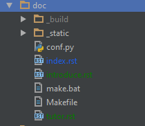

introduce
===============
主要介绍Archives所需要的doc目录

docs
``````````


这是archives所需要的doc目录结构，建议使用recipe模板生成项目结构，因为recipe将会帮您创建好这一目录，你只需要关心如何写代码，
最大程度的享受archives带来的便捷

* _build:   目录主要包含一些html文件，会在构建文档时自动生成，不需要我们手动创建
* _static:  里面主要放一些静态文件，比如一些需要插入带文档里面的图片
* conf.py:  包含一些通用配置信息，一般不需要更改
* index.rst:文档的入口，主页的结构，子页的绑定在这里定义
* xxxxx.rst:这是文档的子页结构，需要在index中绑定
* make.bat :
* Makefile :