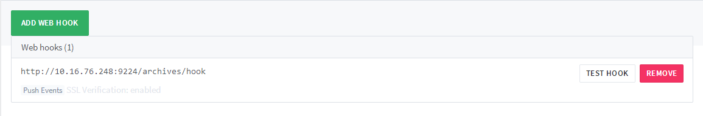

Quick Start
===========
Archives是一个文档自动构建及托管项目， 用于快速编写和维护项目文档。建议使用recipe来构建项目模板，
因为recipe会帮您构建好你所需的doc目录结构，会最大程度的享受Archives带来的便捷

Prerequisites
````````````````

* 文档必须使用reStructuredText编写
* 文档需要位于/doc目录下（recipe生成的项目会包括此结构）
* 文档入口为/doc/index.rst

Usage
``````````````
1.首先需要在trgit2上添加http://10.16.76.248:9224/archives/hook到项目的webhook中



2.如果有代码提交到master，就会触发构建文档，我们就可以通过 `http://scmesos06/docs/ <http://scmesos06/docs/>`_. 就可以访问文档啦

